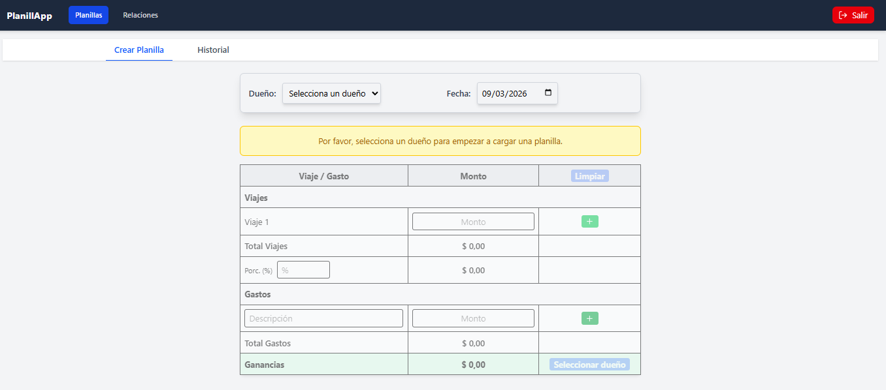
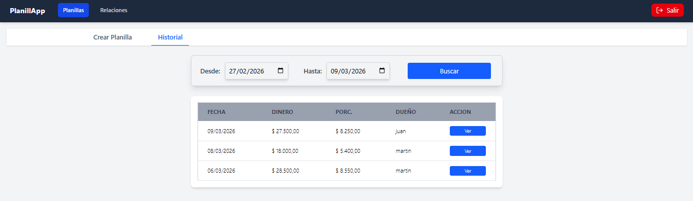
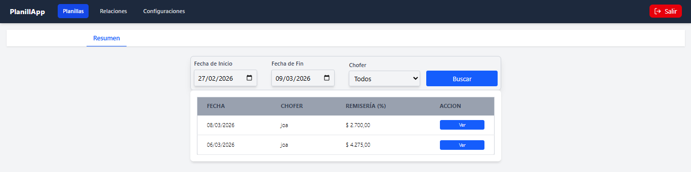

# Sistema de Gestión de Remisería


Aplicación web para la gestión de viajes y gastos en empresas de remisería. 
Permite a los choferes registrar su actividad diaria y a los dueños supervisar la operación mediante un dashboard con filtros y reportes.

**Demo en vivo:** https://planill-app.vercel.app/






## 📋 Tabla de contenido

1. [Funcionalidades](#Funcionalidades)
2. [Tecnologías](#Tecnologías)
3. [Arquitectura](#arquitectura-del-sistema)
4. [Instalación](#instalación-y-ejecución-local)
5. [Despliegue](#despliegue)
6. [Pruebas](#pruebas)
7. [Contribuir](#contribuir)
8. [Contacto](#contacto)
9. [Licencia](#licencia)

## Funcionalidades

- **Autenticación de Usuarios:** Registro e inicio de sesión seguro mediante Supabase Auth.
- **Roles Diferenciados:** Interfaz separada para choferes y dueños con permisos específicos.
- **Gestión de Planillas:** Choferes pueden crear planillas diarias de viajes y gastos.
- **Historial y Detalles:** Consulta del historial de planillas con filtros y desglose de viajes/gastos.
- **Dashboard para Dueños:** Resúmenes de actividad de choferes, con filtros por fecha y chofer.
- **Relaciones Chofer‑Dueño:** Sistema de invitaciones para vincular perfiles.

## Tecnologías

**Frontend:**
- React 19 + Vite
- React Router DOM
- Tailwind CSS
- Axios
- Supabase JS (`@supabase/supabase-js`)
- React Hot Toast para notificaciones

**Backend:**
- PostgreSQL (hosteado por Supabase)
- Supabase Auth para usuarios
- Políticas RLS y funciones definidas en SQL

**Despliegue:**
- Frontend: Vercel (también se puede servir desde Netlify u otro proveedor)

## Arquitectura del Sistema

La aplicación tiene un frontend SPA en React que consume directamente la API de Supabase. La lógica de negocio ligera se implementa en Custom Hooks y contextos; el backend está totalmente gestionado por Supabase (base de datos, auth y funciones).

Esta separación permite un desarrollo ágil y escalable.

## Instalación y Ejecución Local

### 1. Configura la base de datos en Supabase

1.  Crea un proyecto en [supabase.com](https://supabase.com).
2.  Copia la URL del proyecto y la clave anónima (anon key).
3.  En el **SQL Editor** ejecuta el contenido de `db.sql` y luego `db-function.sql` (ambos archivos están en la raíz del repo).

### 2. Prepara el frontend

```bash
git clone <URL_DEL_REPOSITORIO>
cd frontend
npm install
```

Duplica `.env.example` como `.env` y reemplaza los valores:

```env
VITE_SUPABASE_URL="TU_URL_DE_SUPABASE"
VITE_SUPABASE_ANON_KEY="TU_ANON_KEY_DE_SUPABASE"
```

Finalmente ejecuta:

```bash
npm run dev
```

La aplicación quedará corriendo en http://localhost:5173 (o el puerto que indique Vite).

## Despliegue

El frontend está pensado para desplegarse en Vercel. Crea un proyecto en tu cuenta, conecta el repositorio y define las mismas variables de entorno (`VITE_SUPABASE_URL`, `VITE_SUPABASE_ANON_KEY`). El build se hace automáticamente con `npm run build`.

Actualmente la aplicación está disponible en👇

https://planill-app.vercel.app/

También puedes usar Netlify u otro servicio similar; simplemente asegúrate de copiar las variables.

## Pruebas

Actualmente no hay tests automatizados. Para mostrar funcionalidad rápida puedes:

- Crear usuarios de ejemplo en Supabase (chofer y dueño).
- Importar datos de ejemplo usando el SQL.

## Contribuir

Este repositorio está abierto para forks y mejoras. Siéntete libre de:

1. Forkear el proyecto.
2. Crear una rama (`feature/nueva-funcionalidad`).
3. Abrir un pull request con una descripción clara.

También puedes abrir issues si encuentras bugs o quieres sugerir mejoras.

## Contacto

- Autor: *Joaquin Leonel Roba*
- Email: [joaquinleo002@gmail.com]
- LinkedIn: https://www.linkedin.com/in/joaquin-leonel-roba-011206281
- GitHub: https://github.com/joaquinleo

> Estoy disponible para colaborar en proyectos similares y discutir oportunidades laborales.

## Licencia

Este proyecto está bajo la licencia MIT. Ver el archivo [LICENSE](./LICENSE) para más detalles.

